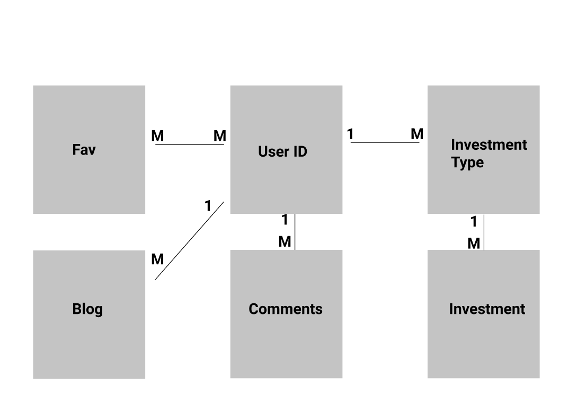

# Investment Web Site Project
Investment web application - SI 664 Personal Project

In this project I will develop a database-backed web site using Django.

## Project Specifications

- The project must be a web site that can be accessed and viewed.
- The project must have at least six data models (i.e. tables)
- The project must have at least three Many-to-One relationships between models and at least one Many-to-Many relationship
- The project must have a feature for end-users to log in. This can be using the internal Django authorization with manually created accounts or use a social login from one or more of the common providers (Github, Google, Twitter, Facebook, etc).
- The project must have at least one example of data coming into the site from users. This could be as simple as a comment or ranking capability or you could build a completely social site intended to be built by the crowd.
- The project is intended to have a nice graphic design - it does not have to be stunning but it also not be default browser with Times New Roman font on a white background

### One-to-many relationships:
- User  id
- Time
- investment type

### Many-to-many relationships:

### UI Design scratch

The **main palettes** I used in this design are listed in the first image. 

* The first image: This is the login page. It contains account login (the combination of User, Email, and Password) and social login (GitHub login).

* The second image: The top block is the main page, which is a list of line charts. People can add comments below. Click on the "trash" icon will navigate users to the confirmation page below.

* The third page: Users can still find charts after they log out if there are any charts that have been published publicly - users can choose to make their stats public or not which is an option that was listed on the fourth image.

* The fourth page: Clicking on the "add table" button, users can add, edit, and delete tables. There are two tables in this application - one is the type table, users can specify APIs (if there is any available) and divide their investments into several types; the other one is the revenue table which can be updated automatically if the APIs were given (I would consider this function as a bonus) or can be specified by users themselves.

### Samples:

sample website(http://liwenjing.pythonanywhere.com/ads/)
