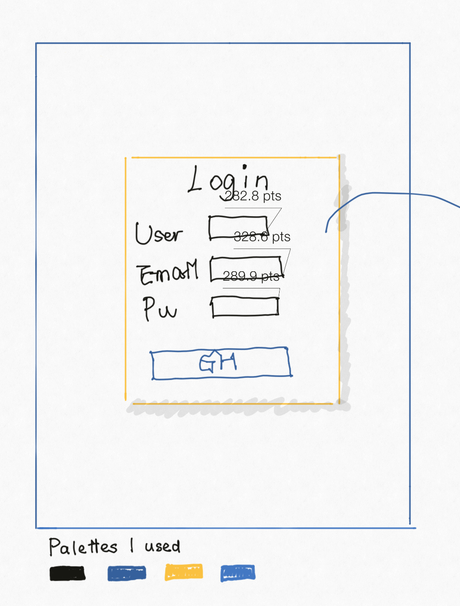

# Investment Web Site Project
Investment web application - SI 664 Personal Project

In this project I developed a database-backed web site using Django.

The final look:

https://project11111.pythonanywhere.com

### Data models:

- The project has six data models (i.e. tables)
- The project has three Many-to-One relationships between models and one Many-to-Many relationship.

### UI Design scratch

* The first image: This is the login page. It contains account login (the combination of User, Email, and Password) and social login (GitHub login).

* The second image: The top block is the main page, which is a list of line charts. People can add comments below. Click on the "trash" icon will navigate users to the confirmation page below.

* The third page: Users can still find charts after they log out if there are any charts that have been published publicly - users can choose to make their stats public or not which is an option that was listed on the fourth image.

* The fourth page: Clicking on the "add table" button, users can add, edit, and delete tables. There are two tables in this application - one is the type table, users can specify APIs (if there is any available) and divide their investments into several types; the other one is the revenue table which can be updated automatically if the APIs were given (I would consider this function as a bonus) or can be specified by users themselves.

### Sample web page created by me:

sample website(http://liwenjing.pythonanywhere.com/ads/)
